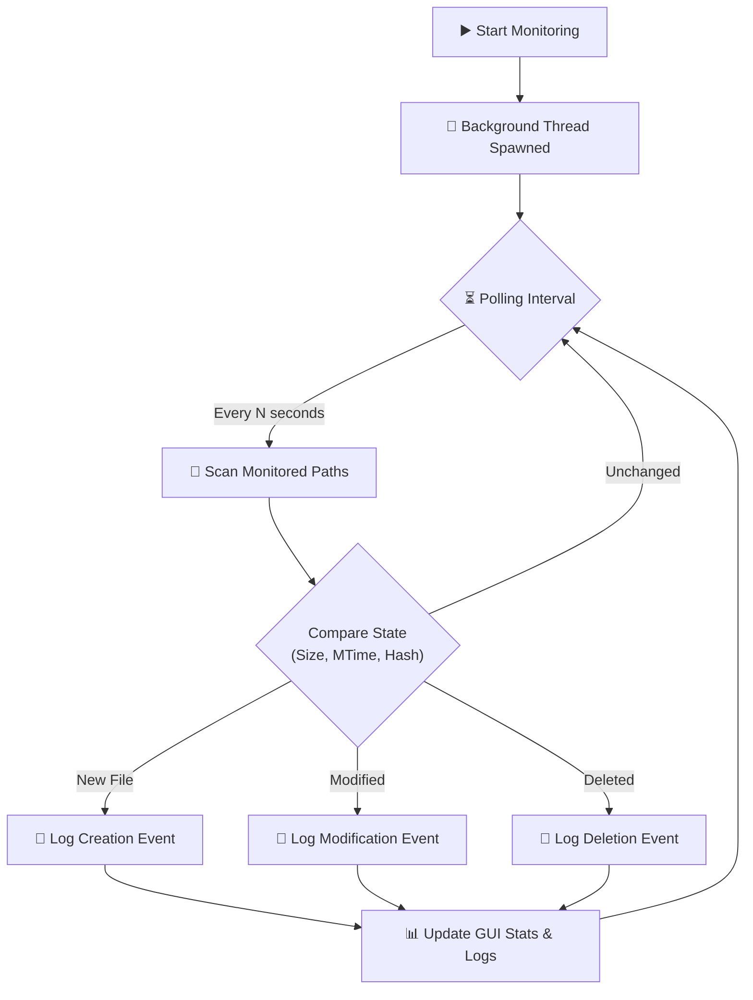

<div align="center">

# 🔒 File Monitoring System

### _A Lightweight, Real-Time File Integrity & Change Monitor_

[](https://python.org)
[](#)
[](#)
[](#-license)

<br/>

```
    ╔══════════════════════════════════════════════════════╗
    ║                                                      ║
    ║        ███████╗██╗██╗     ███████╗                   ║
    ║        ██╔════╝██║██║     ██╔════╝                   ║
    ║        █████╗  ██║██║     █████╗                     ║
    ║        ██╔══╝  ██║██║     ██╔══╝                     ║
    ║        ██║     ██║███████╗███████╗                   ║
    ║        ╚═╝     ╚═╝╚══════╝╚══════╝                   ║
    ║                                                      ║
    ║        ███╗   ███╗ ██████╗ ███╗   ██╗██╗████████╗    ║
    ║        ████╗ ████║██╔═══██╗████╗  ██║██║╚══██╔══╝    ║
    ║        ██╔████╔██║██║   ██║██╔██╗ ██║██║   ██║       ║
    ║        ██║╚██╔╝██║██║   ██║██║╚██╗██║██║   ██║       ║
    ║        ██║ ╚═╝ ██║╚██████╔╝██║ ╚████║██║   ██║       ║
    ║        ╚═╝     ╚═╝ ╚═════╝ ╚═╝  ╚═══╝╚═╝   ╚═╝       ║
    ║                                                      ║
    ║         Track. Monitor. Secure your files.           ║
    ╚══════════════════════════════════════════════════════╝
```

<br/>

> 📁 A **standalone Python application** that monitors your directories for any file modifications, creations, deletions, and integrity changes. Built purely with Python's standard libraries, it requires **zero external packages** and provides a clean graphical interface via `tkinter`.

---

[Features](#-features) •
[How It Works](#-how-it-works) •
[Setup](#-quick-start) •
[Usage](#-usage-guide) •
[Tech Stack](#-tech-stack)

</div>

---

## ✨ Features

<table>
<tr>
<td width="50%">

### 🔍 Real-Time Monitoring
- **Instant detection** of file creations, modifications, and deletions
- Tracks changes in file size and modification timestamps
- Runs smoothly in the background via **threading**
- Continuously polls monitored directories

### 🛡️ File Integrity Checking
- Monitors file hashes to detect silent corruptions or unauthorized alterations
- Tracks internal file state modifications

</td>
<td width="50%">

### 🎛️ Interactive GUI
- Clean, modern **Tkinter interface** with a responsive layout
- Real-time statistics dashboard (events, creations, deletions)
- Scrollable live event log with detailed reports
- On-the-fly monitoring controls (Start/Stop)

### 📂 Custom Directory Support
- Defaults to monitoring `Desktop`, `Documents`, and `Downloads`
- Easily add **custom folders** via the graphical interface
- Includes a "Create Test File" button to instantly verify functionality

</td>
</tr>
</table>

---

## 🧠 How It Works



1. **Initial Scan:** When launched, the system scans all monitored directories and records the baseline state of every file (Size, Modified Time, Created Time).
2. **Background Polling:** A daemon thread continuously walks the directory tree.
3. **State Comparison:** During each pass, it compares the current files against the baseline dictionary.
4. **Event Dispatch:** Discrepancies trigger GUI updates and alert logs.

---

## 🚀 Quick Start

### Prerequisites

| Requirement | Why |
|:---|:---|
| **Python 3.x** | Core runtime engine |
| **Tkinter** | Standard GUI library (usually pre-installed with Python) |

*No `pip install` required!*

### Installation & Execution

**1. Clone the repository**
```bash
git clone https://github.com/hussnainahmedd/file-monitoring-system.git
cd file-monitoring-system/file-monitoring-system
```

**2. Run the application**
```bash
python code.py
```

> [!TIP]
> **Linux Users:** If you receive a `tkinter` not found error, install it via your package manager:
> `sudo apt-get install python3-tk`

---

## 📖 Usage Guide

Once the application is running, you will see the control panel:

1. **🟢 Start System Monitoring:** Click to activate the background tracking thread. The button will turn red (🔴) indicating it is active.
2. **📁 Add Folder:** Click to open a file dialog and select additional directories to monitor.
3. **🧪 Create Test File:** Instantly generates a dummy file in a monitored directory to demonstrate the detection capabilities.
4. **🧹 Clear Logs:** Wipes the current activity log screen.

### Default Monitored Paths
By default, the system monitors your user's primary folders:
- `~/Desktop`
- `~/Documents`
- `~/Downloads`

---

## 🛠️ Tech Stack

<div align="center">

| Component | Library | Purpose |
|:---|:---|:---|
| **GUI Framework** | `tkinter`, `tkinter.ttk` | Creating the graphical interface and styled widgets |
| **Concurrency** | `threading` | Running the file scanner without freezing the UI |
| **File System** | `os` | Directory walking, path manipulation, and file metadata retrieval |
| **Integrity** | `hashlib` | (Planned/Implemented) Computing file hashes for tampering detection |
| **Data Formatting** | `json`, `datetime` | Formatting logs and timestamps |

</div>

---

## 📂 Project Structure

```
file-monitoring-system/
│
├── .gitattributes             # Git configuration
└── file-monitoring-system/    # Main application directory
    └── code.py                # 🐍 The entire application in a single file
```

---

## 🤝 Contributing

1. **Fork** the repository
2. **Create** a feature branch (`git checkout -b feature/amazing-feature`)
3. **Commit** your changes (`git commit -m '✨ Add amazing feature'`)
4. **Push** to the branch (`git push origin feature/amazing-feature`)
5. **Open** a Pull Request

---

## 📜 License

This project is open source and available under the [MIT License](LICENSE).

---

<div align="center">

**⭐ Star this repo if you found it useful!**

<br/>

Built entirely with 🐍 Python Standard Libraries.

</div>
